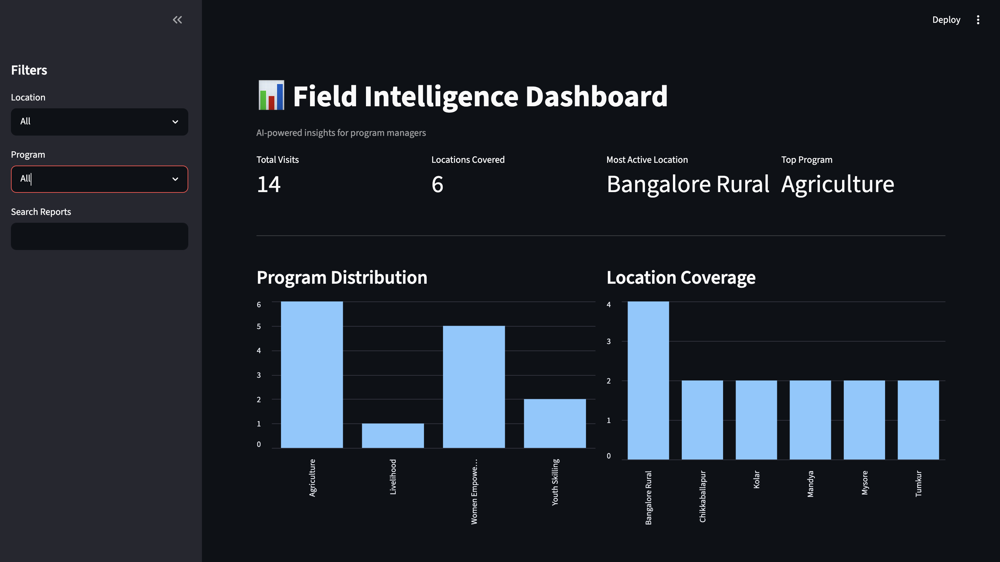
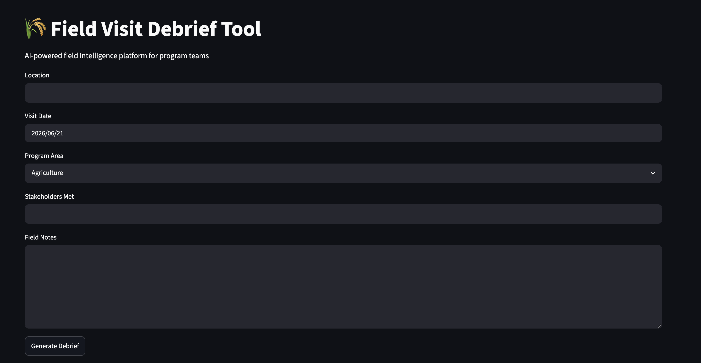
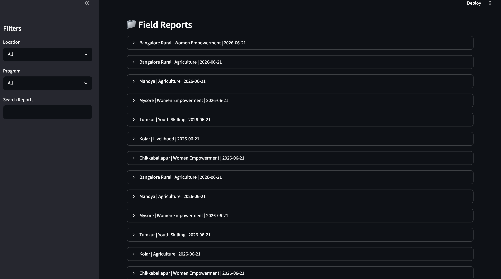
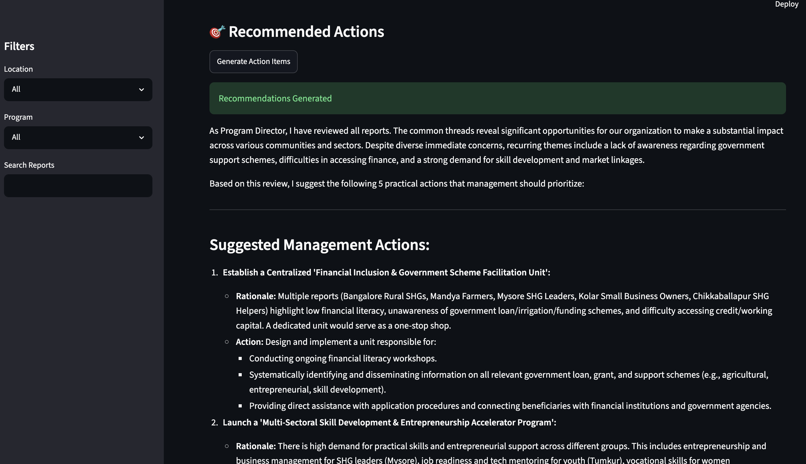

# Field Operations Debrief Platform

## Overview

The Field Operations Debrief Platform is an AI-powered reporting and analytics solution designed to streamline the collection, analysis, and review of field operation reports.

The platform enables users to submit operational reports, maintain a centralized report repository, generate AI-driven recommendations, and visualize key operational insights through an interactive dashboard.

---

## Problem Statement

Field operation teams generate large volumes of reports that often require manual review and analysis. This process can be time-consuming and makes it difficult for decision-makers to quickly identify operational issues, recurring challenges, and opportunities for improvement.

The platform addresses this challenge by combining report management, analytics, and AI-generated recommendations to support faster and more informed decision-making.

---

## Key Features

### Report Submission

* Submit and manage field operation reports
* Store reports in a centralized database
* Maintain historical records for future analysis

### AI-Powered Recommendations

* Analyze submitted reports
* Generate actionable recommendations
* Highlight operational concerns and suggested next steps
* Reduce manual review effort

### Analytics Dashboard

* Visualize operational trends and metrics
* Monitor report activity
* Support data-driven decision making

### Report Management

* View submitted reports
* Track operational activities
* Access historical report data

---

## Technology Stack

### Frontend

* Streamlit

### Backend

* Python

### Database

* SQLite

### AI Integration

* Generative AI API Integration

### Data Visualization

* Plotly
* Streamlit Components

---

## Project Structure

```text
field-operations-debrief-platform/

├── app.py
├── dashboard.py
├── database.py
├── requirements.txt
├── README.md
├── .gitignore
├── .env.example
│
└── screenshots/
```

---

## Dashboard Overview



---

## Report Submission



---

## Report Overview



---

## AI Generated Recommended Actions



---

## System Workflow

1. Users submit field operation reports.
2. Reports are stored in the database.
3. AI analyzes report content.
4. Recommended actions are generated.
5. Dashboard visualizes reports and operational insights.

---

## Future Enhancements

* Multi-user authentication
* Role-based access control
* Advanced trend analysis
* Automated PDF report generation
* Real-time monitoring and alerts
* Conversational AI assistant for report exploration

---

## Repository Note

API credentials and sensitive configuration details have been excluded from the public repository. Environment variables can be configured using the `.env.example` template.
